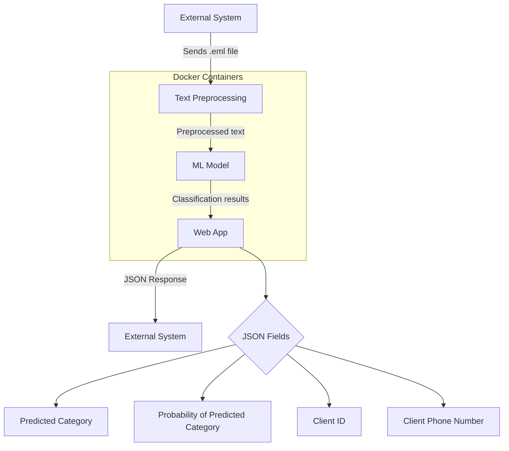

# Document Design: Email classification of the clients

---
## 1. Overview

**Problem**: Historical data of the Telecomunication Company X shows, that in a span of 5 years Company X recieves approximately 5k emails per day on average from their clients about different topics. The current solution of the classification of these emails is to outsource this task to the company Y, which manually classifies emails into 9 categories (Categories are specified  by the business department of the company X). There are 3 main problem in this solution:

- It is expensive: company X must pay 300000 Euro per year amount of money to the company Y.
- Classification is slow: people are quite slow in the task like classification of the email, so it can take a week of time what could be done in an hour by algorithm/machine.
- Classification quality: deep learning models can outperform Humans in text analysis (https://huggingface.co/blog/bert-101#4-berts-performance-on-common-language-tasks : section 4.1 and section 4.2) 
**Solution**: replacement of the manually classification of the emails my ML algorithm.

**Desired outcome**: iterative progress due to the contract with company Y.

Due to the contract agreement with company Y, we can substitute only 20% of the emails stream at the first go live/deployment.

- First go live/deployment of the classifier must replace 20% of the manually classified emails.
- Second deployment of the classifier (in half a year) must replace 40% of the manually classified emails.
- Final goal: to replace at least 70% of the manually classified emails.

## 2. Motivation

**Benifits of the Solution**
- Reducing dependency from the outsource company: we will be in charge of the classification process and its improvement.
- Cuting expanses: infracstructure set up will bee much cheaper than paying 300000 Euro per year to the external party.
- Improving classification quality: ML algorithms are more robust in email classification than human beings.
- Improving classification speed: ML algorithms are much faster in email classification than human beings.

**Urgency and Impact**
- Due to the difficult economical situation in the world, it's improtant to act now in order to cut expanses and dependencies from the outsource companies.
- Reduction the gap between technological status of the company and state-of-the-art approaches will benefit company X right now and in the future.

## 3. Success metrics
- Cost reduction: saving 300000 euro per year (Cost estimation: cost per month * 12 = 250000 * 12 = 300000).

## 4. Requirements & Constraints

**Functional requirements:**
- In the first iteration 20% of the incomming emails per year have prediction confidence 90% or more (decided by stakeholders).
- Final requirement: 70% of the incoming emails per year have prediction confidence 90% or more.
- Extraction of the client number id from the email, if provided.
- Extraction of the client number phone number, if provided.
- Saving classification results in database for futher usage.
  
**Technical requirements**
- Personal data of the clients (name, surname, email adress etc.) must be anonymized.
- Latency: 5 seconds per request (not strict, because the amount of emails is not expected to rise in the nearest future). If necessary, requirements will be more strict. 
- 1 email at time.
- Open Source only: because it's free and expenses neeeded to be cut.

### 4.1 What's in-scope & out-of-scope?

**In-scope**
- Analysis of the client emails, which have .eml format.

**Out-of-scope**
- Additional analysis of attached files like pdf, jpg, which can help in the prediction of the email. Will be implemented in the future version.

## 5. Methodology

### 5.1. Problem statement

This is a classical supervised classification problem, where subject combined with text of the email is an input label (transformed into integer tokens) and category number is an output label (from 0 to 8).

### 5.2. Data

**Training data**:
- Labeled emails by the outsource company Y.

**Input data**
- Client emails in the .eml format. 

### 5.3. Techniques

**Machine Learning technique**
- For the email classification we will start witt the BERT architecture, but distill one (https://huggingface.co/distilbert/distilbert-base-german-cased)

**Preprocessing**
- Deletion of the greetings, signatures and footers of the email: at the first step saving all common greetings and signatures in txt file and use it for regular expression logic. The next step will be to train NER network (https://huggingface.co/flair/ner-german).
- Anonymization of the personal data by using NER network (https://huggingface.co/flair/ner-german).
- Replacing dates, numbers, urls by the coressponding universal tokens (<DATE>, <NUMBER>, <URL>): regex will be deployed.
- Deletion all non-ascii characters except german umlauts.
- Tokinization of the text into the integer tokens: we need to transform text word/tokens into integers, because neural network doesn't work directly with text, but uses integer tokens as an input into the model.

### 5.4. Experimentation & Validation

**Dataset Strategy**

The whole dataset will be splitted into the 3 parts:
- Training dataset: will be used for the model training.
- Validation dataset: will be used for the hyperparameter tuning.
- Test dataset: will be used for the final prediction result estimation.

During the dataset split we will use stratified approach: each dataset contains approximately the same percentage of samples of each target class as the complete set. This will help us to maintain representativeness of among all 3 datasets.

**Technical Metric**
In our case prediction all 9 categories are equally important. That's why we will use f1-score macro average: calculate metrics for each label, and find their unweighted mean. 

**Additional Remarks**
The data among 9 categories are imbalanced (the biggest category contains 300k records, the smallest 1k records) which may lead ML model to become more biased towards the majority class. There is a big debate in ML and Statistical analysis community regarding Resampling like SMOTE (https://stats.stackexchange.com/questions/321970/imbalanced-data-smote-and-feature-selection), so for now we will use existing dataset without artificially generation of the new samples.

There is a modern-day approach of using LLMs for the email generation, but it's still questionable if we should use it for our task, because it will change the training distribution of the data (approximation of the real world emails distribution). That could lead to unknown consequences. This approach must be studied additionally in depth.

### 5.5. Human-in-the-loop

All prediction, with the confidence lower than 90% will be additionally checked by the trained specialist.

## 6. Implementation

### 6.1. High-level design

### 6.2. Infra
- Service will be hosted on premise.
- CPU only (if neccesary, GPU will be deployed, but it's not desired).
- **Technology**: 3 Docker Containers (ML Prediction, Text Cleaning, Web App) combined together by docker-compose yaml file.
- **Registry**: Jfrog Artifactory.

### 6.3. Performance (Throughput, Latency)

How will your system meet the throughput and latency requirements? Will it scale vertically or horizontally?
- **Throughput**: Staheholders requirement is to process 1 email at time (no batch processing).
- **Latency:** 5 seconds per email or less.  It's not strict, because the amount of emails is not expected to rise in the nearest future. If necessary, rlatency must be reduced. 
- **Scaling:** if needed, we will start with vertical scaling.

### 6.4. Security

- We will provide our email classification service as an API, allowing seamless integration. The system responsible for retrieving emails will call this API to classify emails.
- Additional Firewall rules.

### 6.5. Data privacy

Sensetive data will be masked by special tokens (Example: Khreschatyk 1, Kyiv will be marked as <LOCATION>) by the Neural Network (https://huggingface.co/flair/ner-german), spacy NER recognitions (english and german) and regex.

### 6.6. Monitoring & Alarms

- **Event logs**: Every classified record will be saved into the oracle database.
- **Monitoring**: Docker health check will be implemented for each container. If one of the containers will fail, notification will be send to the developer group. Grafana for monitoring
  
### 6.7. Risks & Uncertainties

- Not all sensetive data might be covered.
- Clients (id) could be wrong identified or not identidied at all, hence we cannot assign email to the correct client.

### 6.8. Data Storage and Processing

**Data Storage:**
- Raw emails: Stored in a secure, encrypted object storage system MinIO for 30 days.
- Processed(and anonymized) data: Stored in a relational database (Oracle) for quick access and analysis.
- Model artifacts: Stored in a version-controlled artifact repository (JFrog Artifactory).

**Data Processing:**
- Incoming emails are processed in real-time through the pipeline described in the high-level design.
- Batch processing capabilities will be implemented for reprocessing historical data when needed.

**Data Retention:**
- Raw emails: 30 days
- Processed data: 5 years (legal requirements)
- Classification results: Indefinitely (for long-term analysis and model improvement)

**Data Backup and Recovery:**
- Regular backups of the database and object storage.

**Data Access:**
- Production data: read only access for the developers, read/write access for the production team and stakeholders.
- Development data: read/write access for the developers.